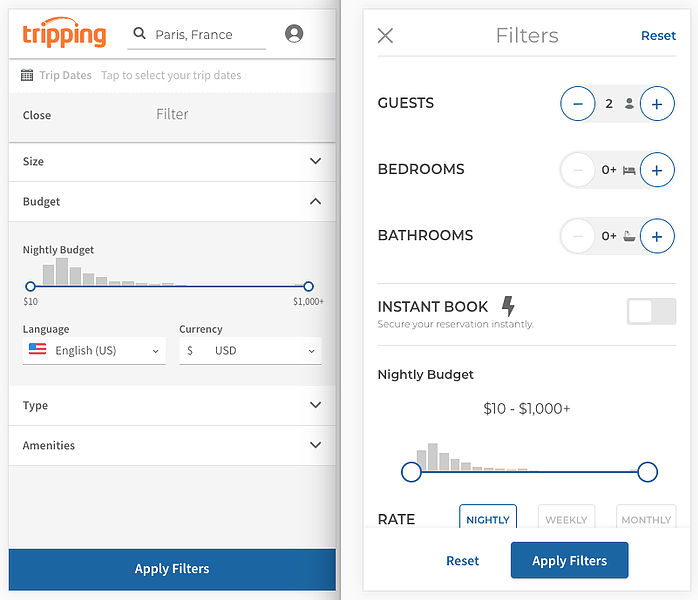
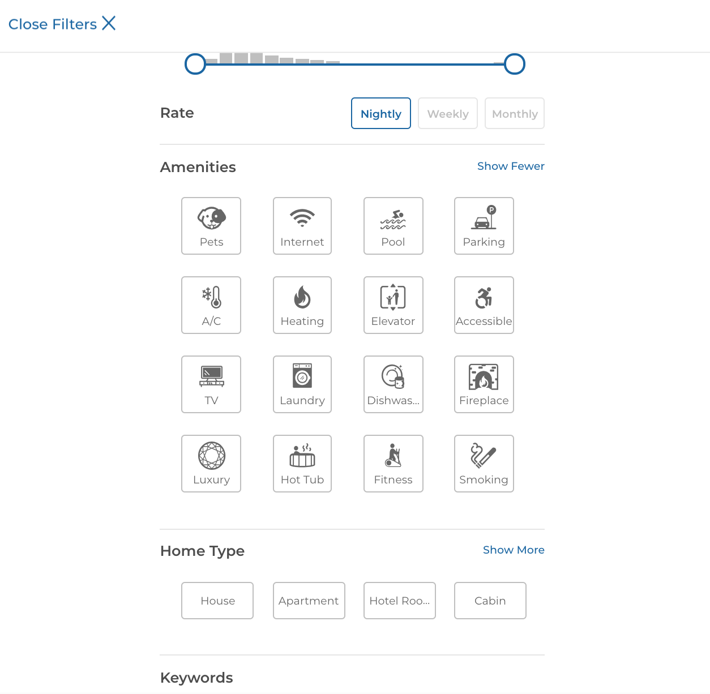
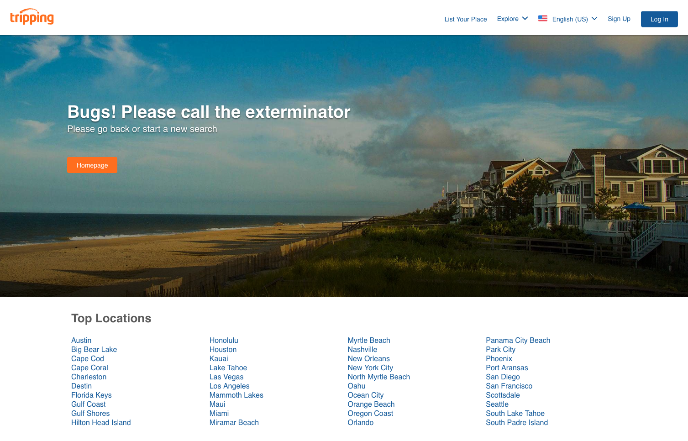
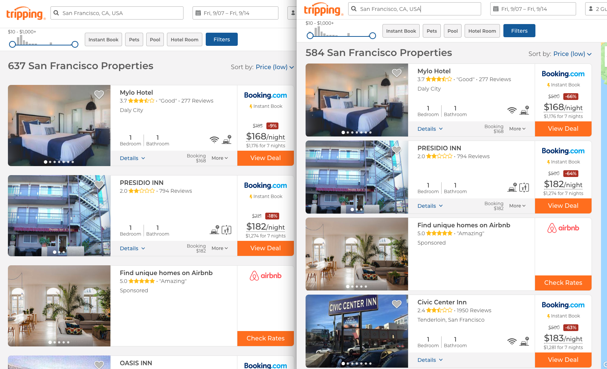

# Tripping Portfolio

Below is a sample of the work I've contributed to at Tripping, now that the original website has been taken down (following an acquisition).

## Table of Contents
* [Revamping the filters experience](https://github.com/valeriewilson/tripping#revamping-the-filters-experience)
* [Overhauling the error page](https://github.com/valeriewilson/tripping#overhauling-the-error-page)
* [Overhauling and optimizing the search results page](https://github.com/valeriewilson/tripping#overhauling-and-optimizing-the-search-results-page)

## Revamping the filters experience

Work done here:
* Identified the need for redesign of search page filters after analysis of current usage data (Google Analytics, Redshift)
* Devised an implementation plan involving vertical grids and a mobile-first approach to responsive breakpoints, followed by iterative work with A/B tests at each stage
* Built a working group with Product and Design to develop product specs and prioritize project with upper management, and timebox tasks
* Built reusable components behind the expanding Amenities and Home Types
* Built filter count replay on "Filters" and "Apply Filters" buttons
* Added ability to sort by rating

Technologies:
* Ruby/Rails
* JS/React

**Result**: increased RPUV by 10%, booking rate by 7%

### Before & After

Expanding filter options:

{:width="100px"}

## Overhauling the error page

Work done here:
* Built out the new error page, from the controller to the bootstrap, wrapper, and JSX/React view files 
* Incorporated an interal API to display the top locations by listing count instead of the original static list
* Incorporated additional React components, such as the navbar, footer, and hero image to make consistent with the rest of the website
* Refactored existing code by removing duplicate html.erb pages for each status code, replacing them with a single dynamic html.erb file; updated the routing accordingly

Technologies:
* Ruby/Rails
* JS/React
* Hypernova

### Before

### After

## Overhauling and optimizing the search results page

Work done here:
* Added content to new SRP rows, from ratings and review counts to the listing title and neighborhood information, as well as logos, top amenities, and price savings for deduped listings

* Added Google text ads below the search results, and on zero-results pages; integrated Intent Media ads for .de and .ru sites
* Once determined that OBC and booking rate decreased with the change from cards to rows, optimized the vertical layout on my own initiative to maximize the number of units above the fold

Technologies:
* Ruby/Rails
* JS/React

**Result**: 10-30% increase in search accuracy; great reception from users
