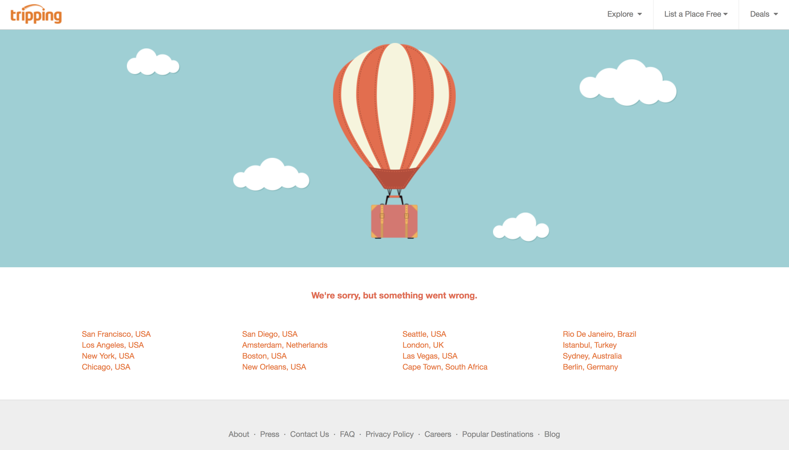

# Tripping Portfolio

Below is a sample of the work I've contributed to at Tripping, now that the original website has been taken down (following an acquisition).

## Table of Contents
[Overhauling the error page](https://github.com/valeriewilson/tripping#overhauling-the-error-page)

## Overhauling the error page

Work done here:
* Built out the new error page, from the controller to the bootstrap, wrapper, and JSX/React view files 
* Incorporated an interal API to display the top locations by listing count instead of the original static list
* Incorporated additional React components, such as the navbar, footer, and hero image to make consistent with the rest of the website
* Refactored existing code by removing duplicate html.erb pages for each status code, replacing them with a single dynamic html.erb file; updated the routing accordingly

Technologies
* Ruby/Rails
* JS/React
* Hypernova

### Before

### After

